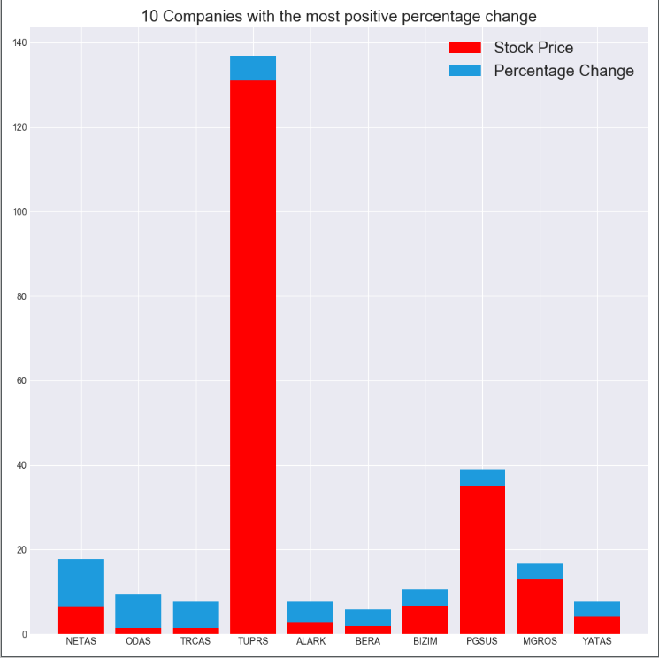
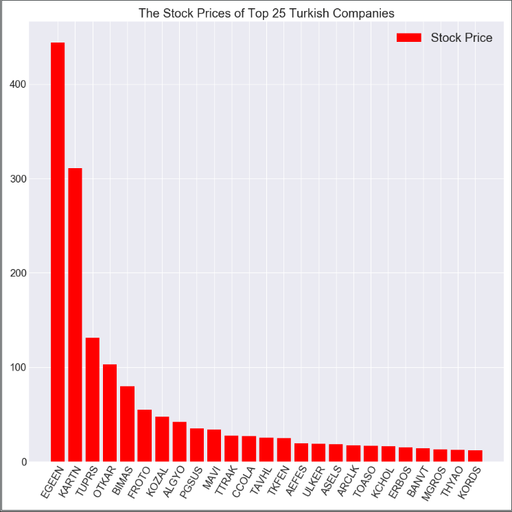
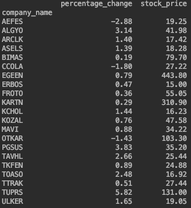
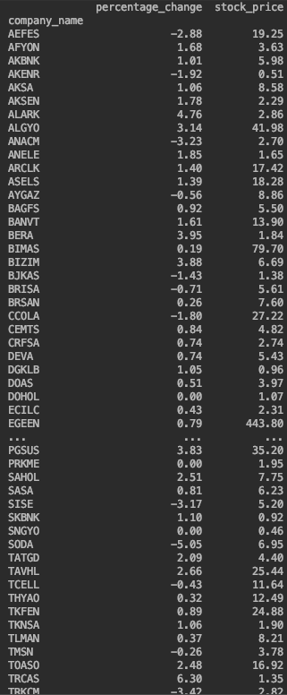
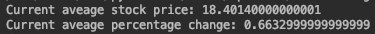

# StockAverage
Stock Average is a web-scraping data analysis project that scraps the stock prices of an index and analyses the data based on the stock price and the average value change of the company. It is only available for Turkey's BIST 100 Market Index right now but I will integrate much more indexes in the near future. Also, the code will be refactored into classes and more methods will be created.


## Installation

Use the package manager [pip](https://pip.pypa.io/en/stable/) to install foobar.

```bash
pip install Stock-Market-Analyzer
```

## Usage

```python
import Stock-Market-Analyzer
and then use the functions or play around with the market analyzer class to create some cool graphs.
```

## Screenshots












## Contributing
Pull requests are welcome. For major changes, please open an issue first to discuss what you would like to change.

Please make sure to update tests as appropriate.

## License
[MIT](https://choosealicense.com/licenses/mit/)
